# Testing

## Contents

- [Validator Testing](#validator-testing)
- [LightHouse Testing](#lighthouse-testing)
- [Testing for user strories](#testing-for-user-stories)
- [Manually Testing](#manually-testing)
- [Responsiveness Testing](#responsiveness-testing)
- [Bugs and solutions](#bugs-and-solutions)

## **Validator Testing**

### **HTML**

I used [W3C Markup Validation Service](https://jigsaw.w3.org/css-validator/) to test my html code.

Because the code is written using Jinja templates, I had to use "view page source" code by right clicking each live page, and run that code through the validator.

I got the following errors :

I fixed this error by replace the `` element with li, and add custom css to style it.

I fixed this error by adding an alt attribute to all `` element.

This is an error due to Jinjia templates, the loop caused duplicated id.

### **CSS**

I have used the W3C CSS Validation Service to validate my CSS code. An error was found see below. ⬇️

I fixed this error by using margin instead of margin-block.

The result came back clear! ⬇️

### **Javascript**

I used [JSHint](https://jshint.com/) to validate my Javascript code. I have got three unused variables, see the error message below. ⬇️

I checked them, `input`are unnessary, so I deleted it.

The "goBack" function are used in HTML as onlick method. See below ⬇️

The same issue for the creatInput function, it has been called in HTML code. See below ⬇️

### **Python**

I checked my app.py file using [PEP8 online](http://pep8online.com/checkresult), errors shows below ⬇️

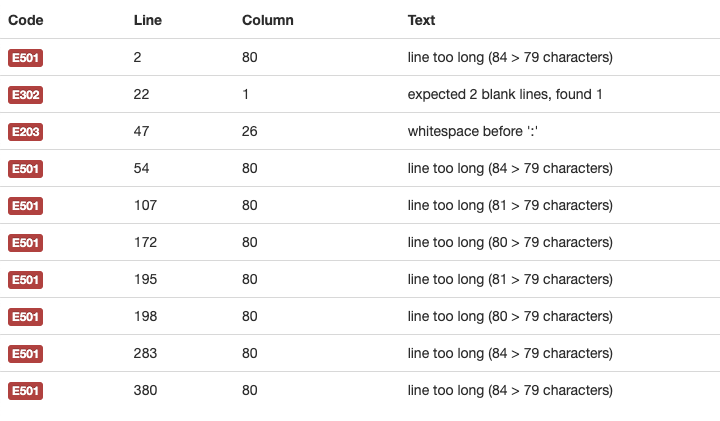

In order to fix the errors, I had to disable Pylance.

## **LightHouse Testing**

After validating all codes, I ran the site through Chrome LightHouse. The initial scores were below: ⬇️

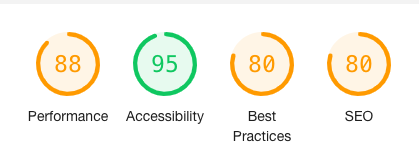

Taking the feedback into account, I have looked into the recommedations and improved the code:

### **Performance**

- Reduced some image size

### **Accessibility**

- Changed footer content color for a sufficient contrast ratio

- Made sure heading element in descending order

- Add alt attribute to all `img` element

### **SEO**

- Add meta description and http-equiv

All of the above changes brought up the score. Although there are still many area to be improve, I am happy with the score for now, and will bare in mind with all the recommendations for future references.

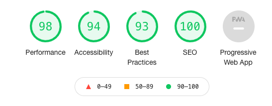

## **Testing for user stories**

As a general user:

- I want to be able to see recipes without having to register an account.

Without register an account, users can browse recipes casually.⬆️

- I want to be able to search recipe with certain ingredients.

- I want to search by specific categories, ie. detox, kids friendly, weight loss etc.

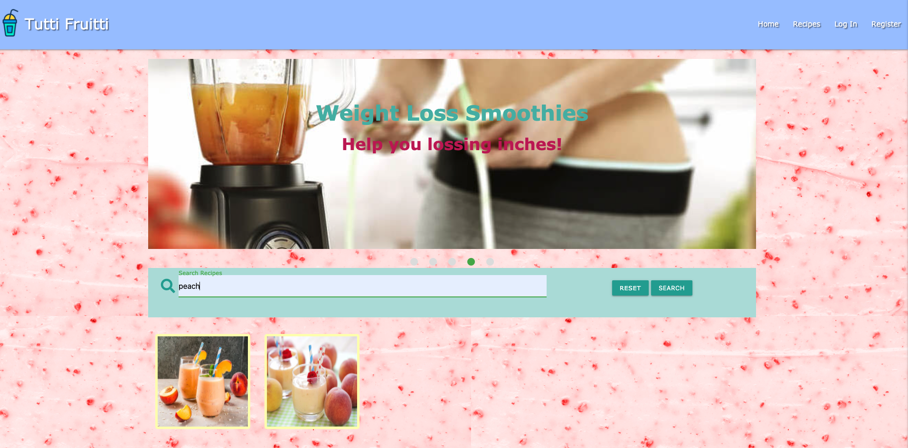

Users are able to search recipes by entering ingredients keyword.⬆️

- I want to be able to share my recipe with other people.

Once the user create an account, they can upload their own recipes to share with the community.⬆️

- I want to have an account so I can come back, add, edit or delete my recipe.

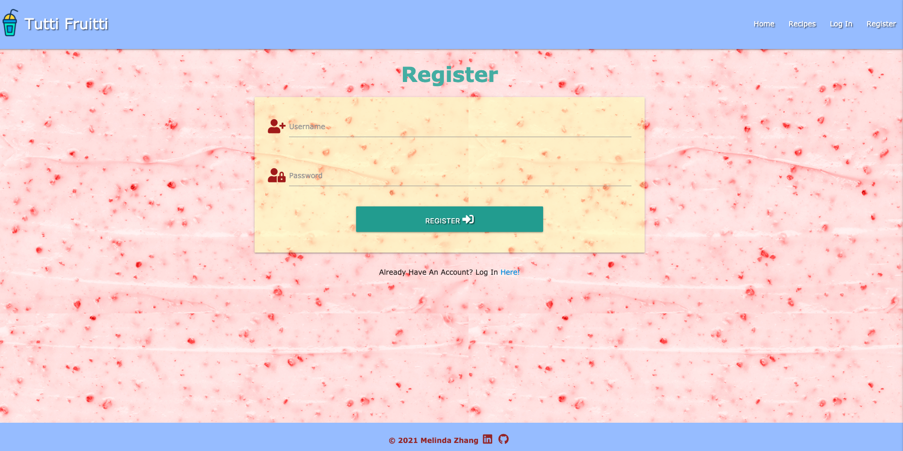

There is an option to create an account, once that is done, the user can come back upload, edit or delete recipes of their own.⬆️

As a first time user:

- I want to know what the website is about.

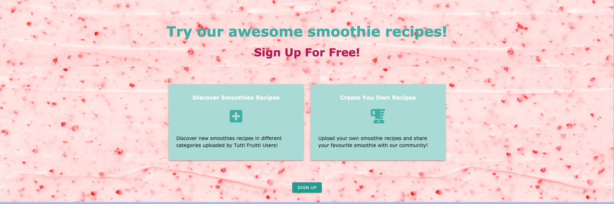

The headline and benefits cards gives the first time visitor an idea what the website is about.⬆️

- I want to have a little taste about how the recipe looks like, is it something I am looking for.

- I want to explore around to get to know the place.

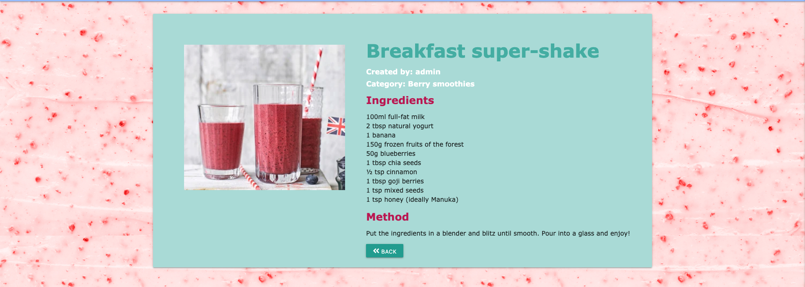

The users would be able to click "view recipe" see for format of a full recipe.⬆️

As a returning user:

- I want to be able to log into my accout.

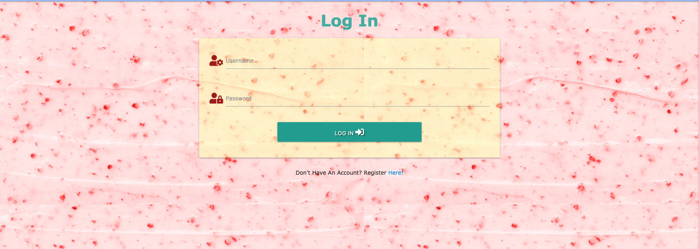

- I want to add recipe to pre-determined categories.

- I want to have access to the recipe I uploaded.

- I want to be able to edit or delete my own recipe anytime if I want to.
  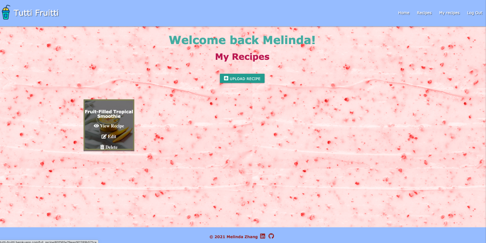
  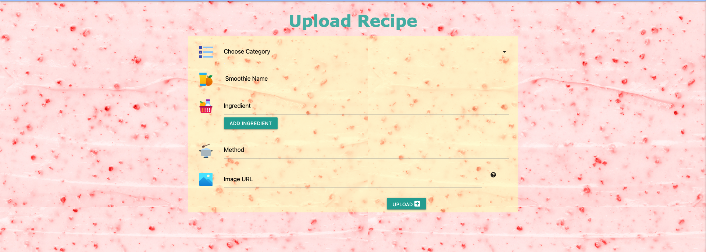
  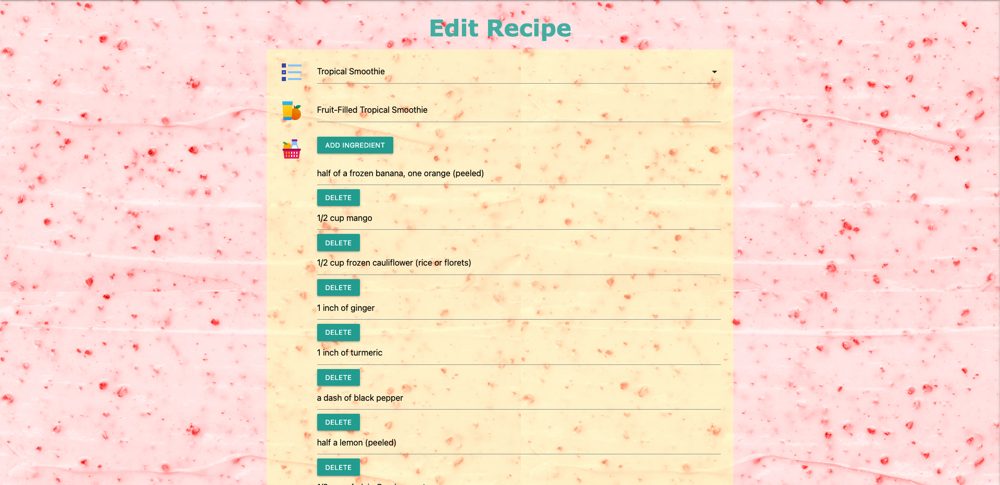
  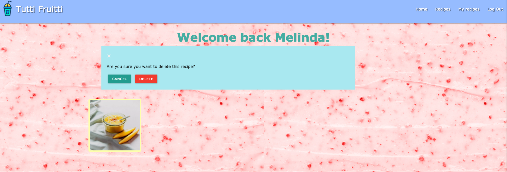

The users are able to upload, edit or delete their own recipes.⬆️

As the site owner/admin:

- I want to be able to add new categories to the site.

Admin can manage the smoothies categoies.⬆️

- I want the new category to be added and displayed as a certain way to go with the flow of the entire site.

- I want to be able to edit the pre-existing categories.

- I want to be able to delete any categories.

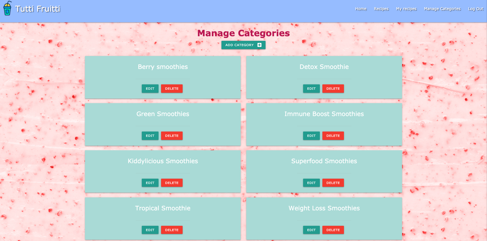

The above images shows those functionalities. ⬆️

## **Manually Testing**
